# Практика 2. Rest Service

## Программирование. Rest Service. Часть I

### Задание А (3 балла)
Создайте простой REST сервис, в котором используются HTTP операции GET, POST, PUT и DELETE.
Предположим, что это сервис для будущего интернет-магазина, который пока что умеет 
работать только со списком продуктов. У каждого продукта есть поля: `id` (уникальный идентификатор),
`name` и `description`. 

Таким образом, json-схема продукта (обозначим её `<product-json>`):

```json
{
  "id": 0,
  "name": "string",
  "description": "string"
}
```

Данные продукта от клиента к серверу должны слаться в теле запроса в виде json-а, **не** в параметрах запроса.

Ваш сервис должен поддерживать следующие операции:
1. Добавить новый продукт. При этом его `id` должен сгенерироваться автоматически
   - `POST /product`
   - Схема запроса:
     ```json
     {
       "name": "string",
       "description": "string"
     }
     ```
   - Схема ответа: `<product-json>` (созданный продукт)
2. Получить продукт по его id
   - `GET /product/{product_id}`
   - Схема ответа: `<product-json>`
3. Обновить существующий продукт (обновляются только те поля продукта, которые были переданы в теле запроса)
   - `PUT /product/{product_id}`
   - Схема запроса: `<product-json>` (некоторые поля могут быть опущены)
   - Схема ответа: `<product-json>` (обновлённый продукт)
4. Удалить продукт по его id
   - `DELETE /product/{product_id}`
   - Схема ответа: `<product-json>` (удалённый продукт)
5. Получить список всех продуктов 
   - `GET /products`  
   - Схема ответа:
     ```
     [ 
       <product-json-1>,
       <product-json-2>, 
       ... 
     ]
     ```

Предусмотрите возвращение ошибок (например, если запрашиваемого продукта не существует).

Вы можете положить код сервиса в отдельную директорию рядом с этим документом.

### Задание Б (3 балла)
Продемонстрируйте работоспособность сервиса с помощью программы Postman
(https://www.postman.com/downloads) и приложите соответствующие скрины, на которых указаны
запросы и ответы со стороны сервиса для **всех** его операций.

#### Демонстрация работы

##### A.1

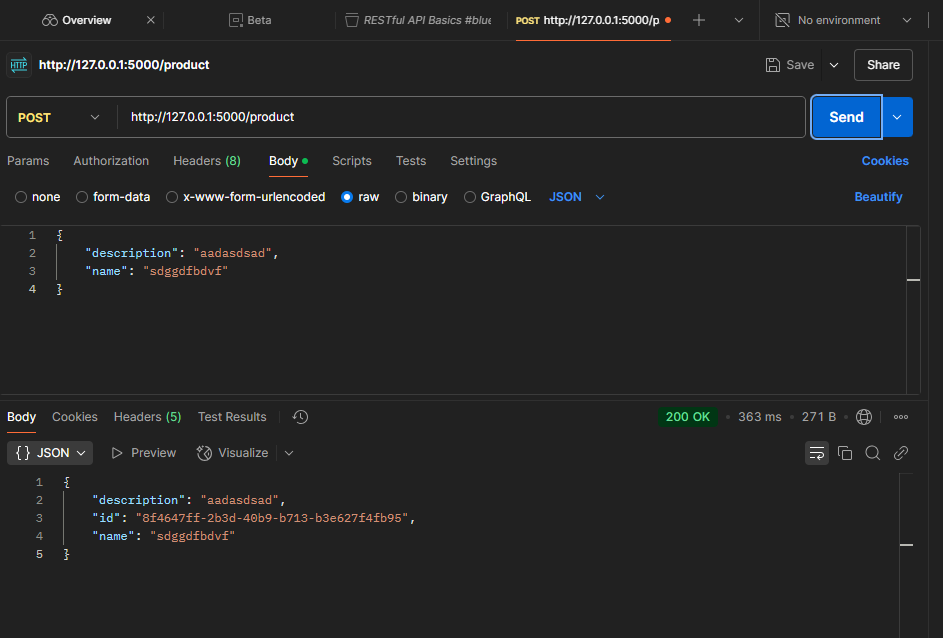

##### A.2

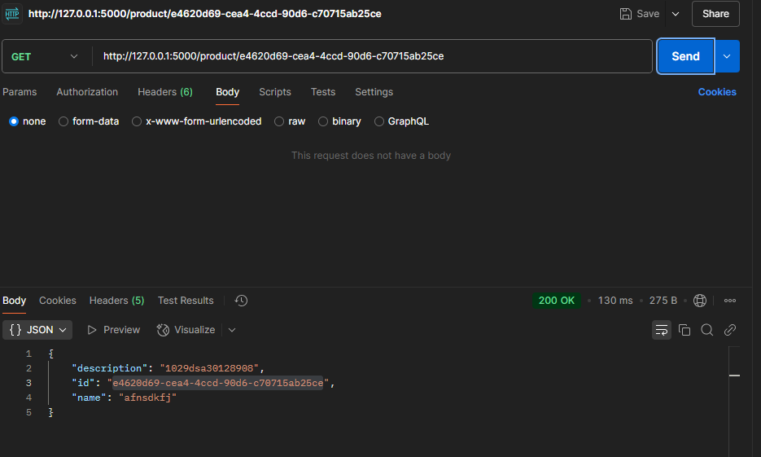

##### A.3

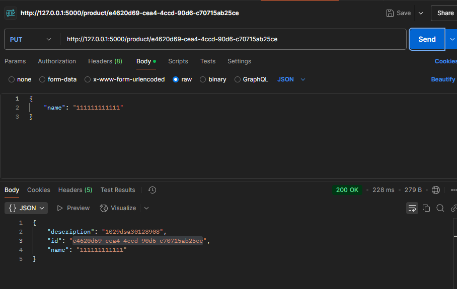

##### A.4

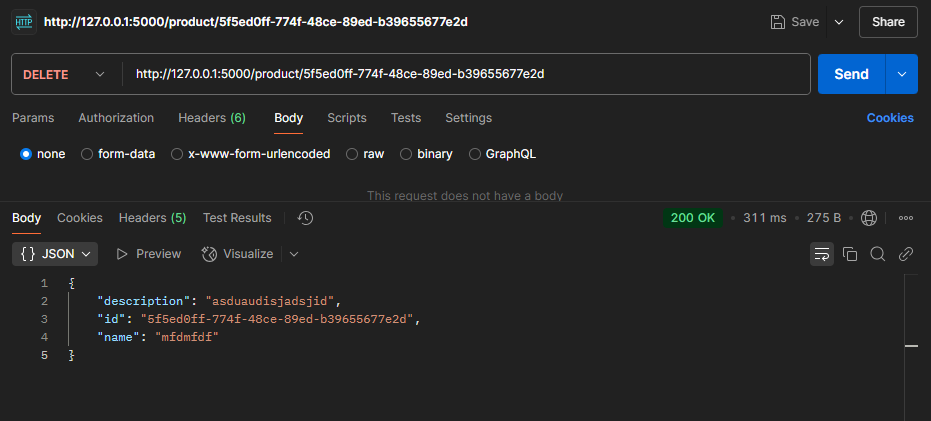

##### A.5

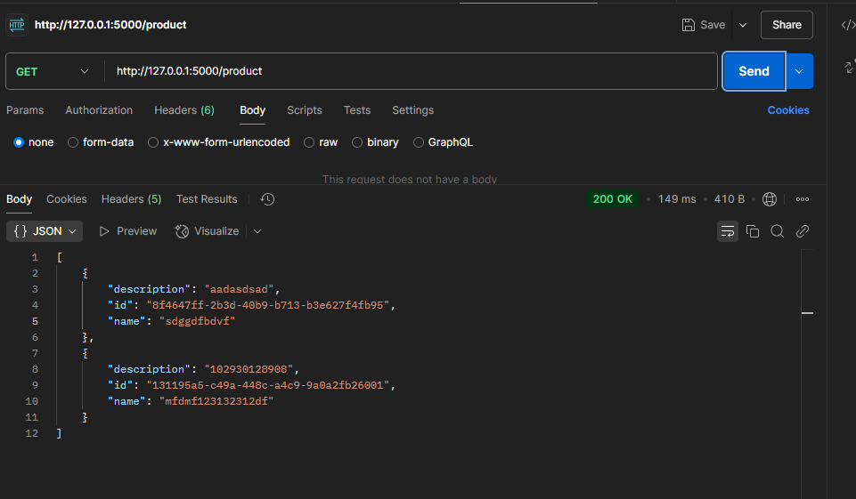

### Задание В (4 балла)
Пусть ваш продукт также имеет иконку (небольшую картинку). Формат иконки (картинки) может
быть любым на ваш выбор. Для простоты будем считать, что у каждого продукта картинка одна.

Добавьте две новые операции:
1. Загрузить иконку:
   - `POST product/{product_id}/image`
   - Запрос содержит бинарный файл — изображение  
     
2. Получить иконку:
   - `GET product/{product_id}/image`
   - В ответе передаётся только сама иконка  
     

Измените операции в Задании А так, чтобы теперь схема продукта содержала сведения о загруженной иконке, например, имя файла или путь:
```json
"icon": "string"
```
Картинки, которые мы кладём на сервер лежат в `../lab02/uploads`

#### Демонстрация работы

##### Положили имадж

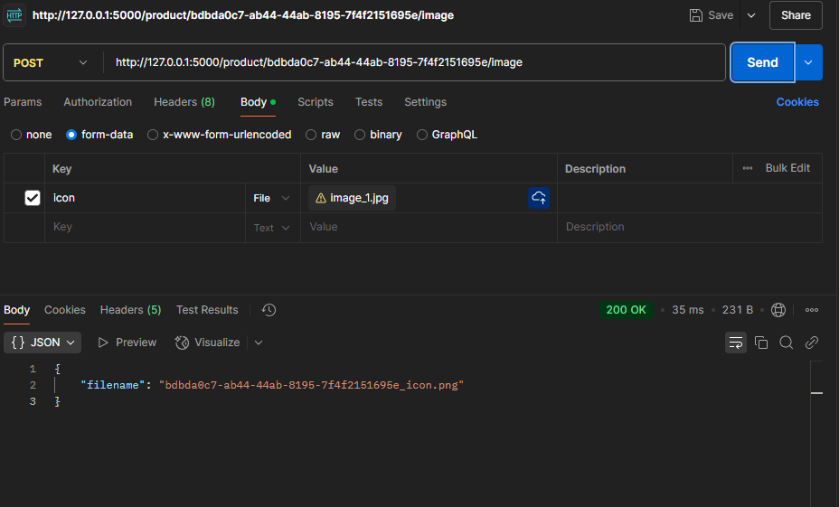

##### Посмотрели как положился имадж

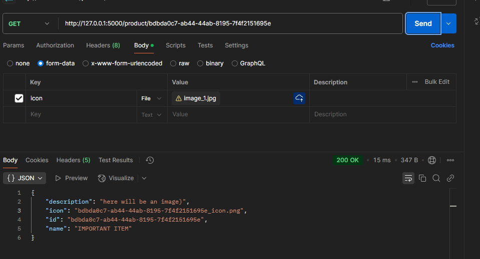

##### Посмотрели на датабазу

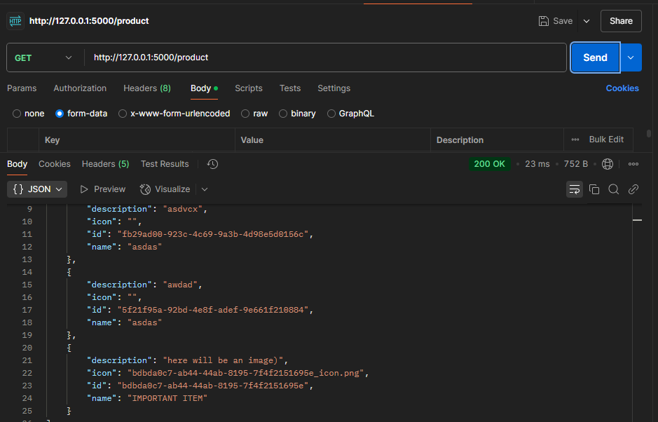

##### Получили имадж

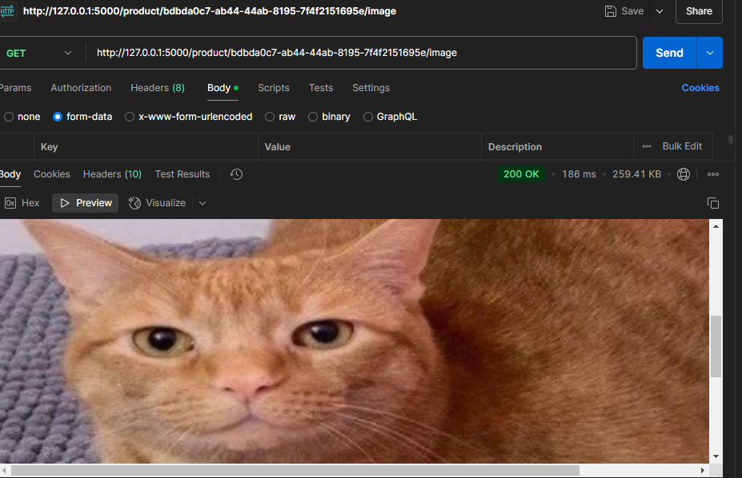

##### Удалили запись айтема с имаджем

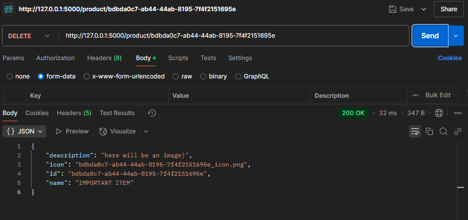

##### Посмотрели, что не можем посмотреть картинку

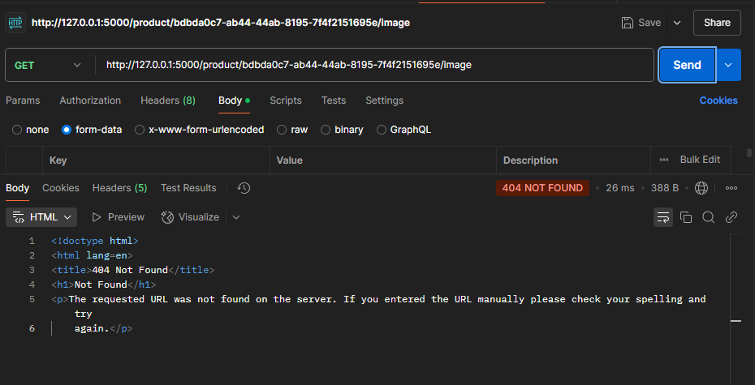

---

_(*) В последующих домашних заданиях вам будет предложено расширить функционал данного сервиса._

## Задачи

### Задача 1 (2 балла)
Общая (сквозная) задержка прохождения для одного пакета от источника к приемнику по пути,
состоящему из $N$ соединений, имеющих каждый скорость $R$ (то есть между источником и
приемником $N - 1$ маршрутизатор), равна $d_{\text{сквозная}} = N \dfrac{L}{R}$
Обобщите данную формулу для случая пересылки количества пакетов, равного $P$.

#### Решение

Если считать, что пакеты посылаются без задержек, друг за другом, то $P\cdot N \cdot \dfrac{L}{R}$ поскольку проход одного пакета по соединению $L/R$ и $d_{\text{сквозная}} = N \dfrac{L}{R}$, то задержка пакета возникает лишь при передаче по соединению, в то время как задержки обработки, ожидания и распределения равны 0.

*Ответ*: $P\cdot N \cdot \dfrac{L}{R}$

### Задача 2 (2 балла)
Допустим, мы хотим коммутацией пакетов отправить файл с хоста A на хост Б. Между хостами установлены три
последовательных канала соединения со следующими скоростями передачи данных:
$R_1 = 200$ Кбит/с, $R_2 = 3$ Мбит/с и $R_3 = 2$ Мбит/с.
Сколько времени приблизительно займет передача на хост Б файла размером $5$ мегабайт?
Как это время зависит от размера пакета?

#### Решение

Для начала, обозначим, что мы пренебрегаем всеми прочими задержками, кроме задержки передачи.  
Конвертируем скорости передачи данных:  
$R_1 = 200\cdot 10^3 / 8$ (байт/с)  
$R_2 = 3\cdot 10^6 / 8$ (байт/с)  
$R_3 = 2\cdot 10^6 / 8$ (байт/с)  
$5$ (Мб) = $5\cdot 10^6$ (байт)

Тогда, *Ответ*: $$d_{\text{сквозная}} = \frac{5\cdot 10^6}{200\cdot 10^3 / 8} + \frac{5\cdot 10^6}{3\cdot 10^6 / 8} + \frac{5\cdot 10^6}{2\cdot 10^6 / 8} = 233.(3)$$

Время линейно зависит от размера $L$:

$$d_{\text{сквозная}} = L\cdot \sum \dfrac{1}{R_i}$$

### Задача 3 (2 балла)
Предположим, что пользователи делят канал с пропускной способностью $2$ Мбит/с. Каждому
пользователю для передачи данных необходима скорость $100$ Кбит/с, но передает он данные
только в течение $20$ процентов времени использования канала. Предположим, что в сети всего $60$
пользователей. А также предполагается, что используется сеть с коммутацией пакетов. Найдите
вероятность одновременной передачи данных $12$ или более пользователями.

#### Решение

$$\sum\limits_{n = 12}^{20} C_{60}^{n}\cdot 0.2^n \cdot 0.8^{60-n}$$

Пояснение: больше 20 юзеров передавать данные не могут: каждому нужно 100 Кбит/с, доступно 2_000 Кбит/с. Каждый член = возможность выбрать n юзеров из 60 при условии, что n юзеров - передают пакеты, а 60 - n - нет.


### Задача 4 (2 балла)
Пусть файл размером $X$ бит отправляется с хоста А на хост Б, между которыми три линии связи и
два коммутатора. Хост А разбивает файл на сегменты по $S$ бит каждый и добавляет к ним
заголовки размером $80$ бит, формируя тем самым пакеты длиной $L = 80 + S$ бит. Скорость
передачи данных по каждой линии составляет $R$ бит/с. Загрузка линий мала, и очередей пакетов
нет. При каком значении $S$ задержка передачи файла между хостами А и Б будет минимальной?
Задержкой распространения сигнала пренебречь.

#### Решение

$$d_{\text{сквозная}}(S) = (80+S)\frac{X}{S}\cdot \frac{3}{R},\;\text{кол-во пакетов} = \dfrac{X}{S} \in \bold{N}, S\in\bold{N}$$

$$d_{\text{сквозная}}(S)' = \frac{3}{R}\left(-\dfrac{80X}{S^2}\right)$$

Значит, $d_{\text{сквозная}}$, как функция от $S$ - убывающая, следовательно, мин значение достигается на $S = X$ и равно $(80+X)\dfrac{3}{R}$

### Задание 5 (2 балла)
Рассмотрим задержку ожидания в буфере маршрутизатора. Обозначим через $I$ интенсивность
трафика, то есть $I = \dfrac{L a}{R}$.
Предположим, что для $I < 1$ задержка ожидания вычисляется как $\dfrac{I \cdot L}{R (1 – I)}$. 
1. Напишите формулу для общей задержки, то есть суммы задержек ожидания и передачи.
2. Опишите зависимость величины общей задержки от значения $\dfrac{L}{R}$.

#### Решение

1. $$\dfrac{I \cdot L}{R (1 – I)} + \dfrac{L}{R} = \dfrac{L}{R}\cdot\dfrac{1}{1-I}$$ 

2. $$\dfrac{L}{R}\left(\dfrac{I}{1 – I} + 1 \right) - \text{линейная зависимость}$$
