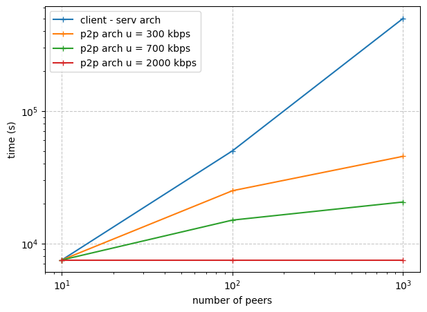

# Практика 5. Прикладной уровень

## Программирование сокетов.

### A. Почта и SMTP (7 баллов)

### 1. Почтовый клиент (2 балла)
Напишите программу для отправки электронной почты получателю, адрес
которого задается параметром. Адрес отправителя может быть постоянным. Программа
должна поддерживать два формата сообщений: **txt** и **html**. Используйте готовые
библиотеки для работы с почтой, т.е. в этом задании **не** предполагается общение с smtp
сервером через сокеты напрямую.

Приложите скриншоты полученных сообщений (для обоих форматов).

#### Демонстрация работы
todo

### 2. SMTP-клиент (3 балла)
Разработайте простой почтовый клиент, который отправляет текстовые сообщения
электронной почты произвольному получателю. Программа должна соединиться с
почтовым сервером, используя протокол SMTP, и передать ему сообщение.
Не используйте встроенные методы для отправки почты, которые есть в большинстве
современных платформ. Вместо этого реализуйте свое решение на сокетах с передачей
сообщений почтовому серверу.

Сделайте скриншоты полученных сообщений.

#### Демонстрация работы
todo

### 3. SMTP-клиент: бинарные данные (2 балла)
Модифицируйте ваш SMTP-клиент из предыдущего задания так, чтобы теперь он мог
отправлять письма с изображениями (бинарными данными).

Сделайте скриншот, подтверждающий получение почтового сообщения с картинкой.

#### Демонстрация работы
todo

---

_Многие почтовые серверы используют ssl, что может вызвать трудности при работе с ними из
ваших приложений. Можете использовать для тестов smtp сервер СПбГУ: mail.spbu.ru, 25_

### Б. Удаленный запуск команд (3 балла)
Напишите программу для запуска команд (или приложений) на удаленном хосте с помощью TCP сокетов.

Например, вы можете с клиента дать команду серверу запустить приложение Калькулятор или
Paint (на стороне сервера). Или запустить консольное приложение/утилиту с указанными
параметрами. Однако запущенное приложение **должно** выводить какую-либо информацию на
консоль или передавать свой статус после запуска, который должен быть отправлен обратно
клиенту. Продемонстрируйте работу вашей программы, приложив скриншот.

Например, удаленно запускается команда `ping yandex.ru`. Результат этой команды (запущенной на
сервере) отправляется обратно клиенту.

#### Демонстрация работы
todo

### В. Широковещательная рассылка через UDP (2 балла)
Реализуйте сервер (веб-службу) и клиента с использованием интерфейса Socket API, которая:
- работает по протоколу UDP
- каждую секунду рассылает широковещательно всем клиентам свое текущее время
- клиент службы выводит на консоль сообщаемое ему время

#### Демонстрация работы
todo

## Задачи

### Задача 1 (2 балла)
Рассмотрим короткую, $10$-метровую линию связи, по которой отправитель может передавать
данные со скоростью $150$ бит/с в обоих направлениях. Предположим, что пакеты, содержащие
данные, имеют размер $100000$ бит, а пакеты, содержащие только управляющую информацию
(например, флаг подтверждения или информацию рукопожатия) – $200$ бит. Предположим, что у
нас $10$ параллельных соединений, и каждому предоставлено $1/10$ полосы пропускания канала
связи. Также допустим, что используется протокол HTTP, и предположим, что каждый
загруженный объект имеет размер $100$ Кбит, и что исходный объект содержит $10$ ссылок на другие
объекты того же отправителя. Будем считать, что скорость распространения сигнала равна
скорости света ($300 \cdot 10^6$ м/с).
1. Вычислите общее время, необходимое для получения всех объектов при параллельных
непостоянных HTTP-соединениях
2. Вычислите общее время для постоянных HTTP-соединений. Ожидается ли существенное
преимущество по сравнению со случаем непостоянного соединения?

#### Решение

**1. Непостоянное соединение требует на передачу каждого объекта новое соединение.**

* время распространения сигнала (в одну сторону вдоль кабеля)
$$t_{prop} = \frac{10 (m)}{300\cdot 10^6 (m/s)} = 3 \cdot 10^{-7} (s)$$

* время рукопожатия (установки соединения - установка соединения требует 3 пакета (SYN, SYN-ACK, ACK))
$$t_{handshake} = \frac{3\cdot 200 (b)}{150 (b/s)} + 3t_{prop}$$

* время передачи даты (данные + пакет контроля \- запрос)
$$t_{transfer} = \frac{100 000 (b) + 200 (b)}{150 (b/s)} + t_{prop}$$

* время подтверждения
$$t_{ack} = \frac{200 (b)}{150 (b/s)} + t_{prop}$$

* так, на один пакет уходит
$$t_{pack} = t_{handshake} + t_{transfer} + t_{ack} = $$
$$\frac{600 (b) + 100200 (b) + 200 (b)}{150 (b/s)} + 5t_{prop} = \frac{101000}{150}(s) + 5\cdot 3\cdot 10^{-7} (s)$$

По сути нам надо отправить 11 пакетов (1 пакет + 10 ссылок)
засылаем в два этапа: сначала параллельно используем канал для 10 пакетов потом досылаем 1 пакет:

$$\left[\frac{101000}{150}(s)\cdot 10 + 5\cdot 3\cdot 10^{-7} (s)\right] + \left[\frac{101000}{150}(s) + 5\cdot 3\cdot 10^{-7} (s)\right] =$$
$$= 6733.3 + 673.3 + 15 \cdot 10^{-7} = 7406.67 \text{ (с точностью до сотых)}$$

**2. Постоянное соединение - одно рукопожатие для всех пакетов**

* время на передачу пакета
$$t_{pack} = t_{transfer} + t_{ack}$$

* общее время (нельзя распараллелить отправку пакетов тк сокет один раз открываем)
$$t_{handshake} + 11\cdot \left[\frac{100200 (b) + 200 (b)}{150 (b/s)} \cdot +2t_{prop}\right] =$$
$$=4(s) + 11\cdot [669.33 + 0] (s) = 4(s) + 7362.67 (s) = 7366.67 (s)$$

**Q. существенной разницы постоянного соединения с непостоянным - нет для текущего набора данных**

посмотрим на формулы

$N$ - пакетов $\xi_n \;(b)$ - вес пакета, $\tau \;(b)$ - вес пакета контроля, $t_{prop} \;(s)$ - скорость распространения сигнала.

$$T_{total;\;nonconst} = \sum_{n:\; \text{}}\left[\frac{\sum_1^{10}\{\xi_n\;(b)\} + 40\tau (b)}{15 (b/s)} + 5\cdot t_{prop} (s)\right] + \left[\frac{\xi_n\;(b) + 4\tau(b)}{150 (b/s)} + 5\cdot t_{prop} (s)\right]\geq$$
$$\geq\frac{\sum_1^N\left[\xi_n\right]}{15}+ N\cdot\left[\frac{40\tau}{15}+5 t_{prop}\right]$$

$$T_{total;\;const} = 3\frac{\tau}{150} (s) + 3t_{prop}(s) + \sum_1^N\left[\frac{\xi_n + 2\tau}{150}(s) + 2\cdot t_{prop}(s)\right]=$$
$$=\frac{\sum_1^N \xi_n}{150} + \left(\frac{1}{50} + N\frac{1}{75}\right)\tau + \left(3+2N\right)t_{prop}$$

$$\Delta = T_{total;\;nonconst} - T_{total;\;const} \geq$$
$$\geq  N\cdot\left[\frac{40\tau}{15}+5 t_{prop}\right] - \left(\frac{1}{50} + N\frac{1}{75}\right)\tau - \left(3+2N\right)t_{prop}+$$
$$+\sum(\xi_n)\frac{9}{150}=$$
$$=N\left[\frac{4\tau}{15} + 5t_{prop} - \frac{\tau}{75} - 2t_{prop}\right] -\frac{\tau}{50}-3t_{prop}+\sum(\xi_n)\frac{9}{150} > 0\;(?)$$

$$\Delta (N;\tau,t_{prop})\geq N\left[\frac{19\tau}{75} + 3t_{prop}\right] -\frac{\tau}{50}-3t_{prop}+\sum(\xi_n)\frac{9}{150}$$

видим, что по $N$ разница $\Delta$ оценивается снизу полиномом с положительным коэффициентом линейной части при фиксированном времени распространения и размере пакета контроля.

$$T_{total;\;nonconst} = T_{total;\;const} + N\left[\frac{19\tau}{75} + 3t_{prop}\right] -\left[\frac{\tau}{50}+3t_{prop}\right] +\sum(\xi_n)\frac{9}{150} - \varepsilon$$
$\varepsilon > 0 \text{ мало}$

**с ростом кол-ва пакетов непостоянное соединение начинает всё сильнее проигрывать по времени постоянному соединению.**

### Задача 2 (3 балла)
Рассмотрим раздачу файла размером $F = 15$ Гбит $N$ пирам. Сервер имеет скорость отдачи $u_s = 30$
Мбит/с, а каждый узел имеет скорость загрузки $d_i = 2$ Мбит/с и скорость отдачи $u$. Для $N = 10$, $100$
и $1000$ и для $u = 300$ Кбит/с, $700$ Кбит/с и $2$ Мбит/с подготовьте график минимального времени
раздачи для всех сочетаний $N$ и $u$ для вариантов клиент-серверной и одноранговой раздачи.

#### Решение

* минимальное время раздачи для клиент-серверной архитектуры
$$t_{c-s}=\max\left\{\frac{NF}{u_s};\frac{F}{d_i}\right\}$$

* минимальное время раздачи для p2p архитектуры
$$t_{p2p}=\max\left\{\frac{F}{u_s};\frac{F}{d_i};\frac{NF}{u_s+N\cdot u}\right\}$$

### Задача 3 (3 балла)
Рассмотрим клиент-серверную раздачу файла размером $F$ бит $N$ пирам, при которой сервер
способен отдавать одновременно данные множеству пиров – каждому с различной скоростью,
но общая скорость отдачи при этом не превышает значения $u_s$. Схема раздачи непрерывная.
1. Предположим, что $\dfrac{u_s}{N} \le d_{min}$.
   При какой схеме общее время раздачи будет составлять $\dfrac{N F}{u_s}$ ?
2. Предположим, что $\dfrac{u_s}{N} \ge d_{min}$. 
   При какой схеме общее время раздачи будет составлять  $\dfrac{F}{d_{min}}$?
3. Докажите, что минимальное время раздачи описывается формулой $\max\left(\dfrac{N F}{u_s}, \dfrac{F}{d_{min}}\right)$?

#### Решение

**1. Равномерное распределение скорости сервера между всеми пирами.**

Если сервер отправляет данные каждому пиру со скоростью $u_s/N$, то время передачи файла размером $F$ одному пиру: $$T_{peer}=\frac{F}{u_s/N} = \frac{NF}{u_s}.$$

Так как сервер обслуживает всех пиров одновременно, общее время раздачи равно времени передачи одному пиру: $T = T_{peer}$

**2. Выделение минимальной необходимой скорости $d_{min}$ самому медленному пиру.**

Самый медленный пир (со скоростью $d_{min}$) ограничивает общее время раздачи. Время передачи файла такому пиру:

$$T=\frac{F}{d_{min}}.$$
Сервер может выделить этому пиру скорость $d_{min}$, а избыток скорости $$\frac{u_s}{N} - d_{min}$$
распределить между другими пирами.  
Однако это не влияет на общее время, так как самый медленный пир уже получит файл за $$\frac{F}{d_{min}}.$$

**3. Минимальное время — максимум из двух сценариев**

минимальное время всегда определяется узким местом в системе:

* $\frac{u_s}{N} \geq d_{min}$:

$$\frac{NF}{u_s} \leq \frac{F}{d_{min}}$$

* $\frac{u_s}{N} \leq d_{min}$:

$$\frac{NF}{u_s} \geq \frac{F}{d_{min}}$$

* тогда, получаем, в первом случае - максимальное время $\frac{F}{d_{min}}$, во втором - $\frac{NF}{u_s}$.

Значит, в системе, узкое место описывается как $$\max\left\{\frac{F}{d_{min}};\frac{NF}{u_s}\right\}.$$

